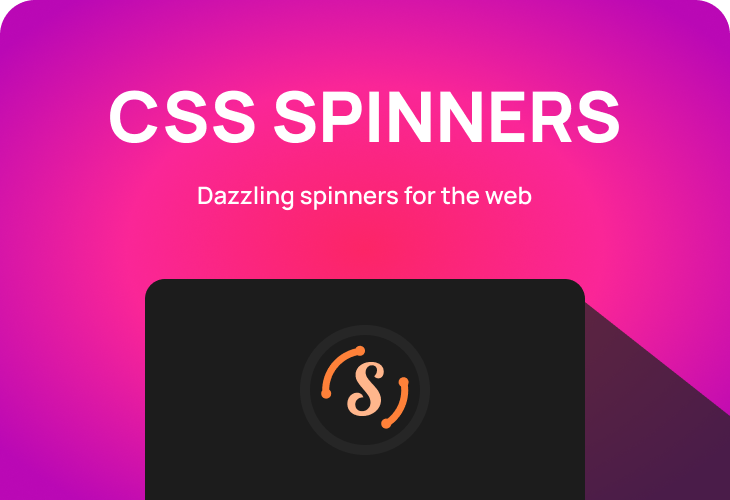

<p align="center"></p>

<p align="center"><strong>CSS Spinners</strong></p>

<p align="center">Dazzling spinners for the web</p>

<br />

<p align="center"></p>

---

### 🌐 Website

https://axorax.github.io/css-spinners/

### 🤝 Contributing

To contribute, fork the repository, make the improvements and open a pull request. Pull requests won't be accepted if its only a:

- Code refactor
- Variable, class, id, etc. name change
- Decreases site accessibility
- Code that doesn't change anything

All spinners are in the `data` folder in the root directory.

If you are adding a new spinner, go to the last file in data or the file that has the largest number after `spinners-`. A file can have 40 spinners at max.

If the file already has 40 spinners then create a new file with the name `spinners-<number>.json`. `<number>` should be the next number after the largest number in the spinners file names.

If the file has less than 40 spinners, then add your spinner at the bottom.

The spinners should be added with this code:

```json
  "<number>": {
    "h": "YOUR_HTML_CODE",
    "c": "YOUR_CSS_CODE"
  }
```

Before, `"<number>": {` in the above line, make sure there is a comma at the end after the curly brace like this `},`.

After that, you need to go into the `info.js` file in the `data` folder and increase `totalSpinners` by one. For example, if `totalSpinners` is 357, you should set it to 358.

### 👍 Credits

- [cssloaders](https://cssloaders.github.io/)
- [Iulius90](https://codepen.io/Iulius90/pen/RaeWmY)
- [spinkit](https://tobiasahlin.com/spinkit/)
- [text-spinners](https://maxbeier.github.io/text-spinners/)

---

[Support me on Patreon](https://www.patreon.com/axorax) -
[Check out my socials](https://github.com/axorax/socials)
